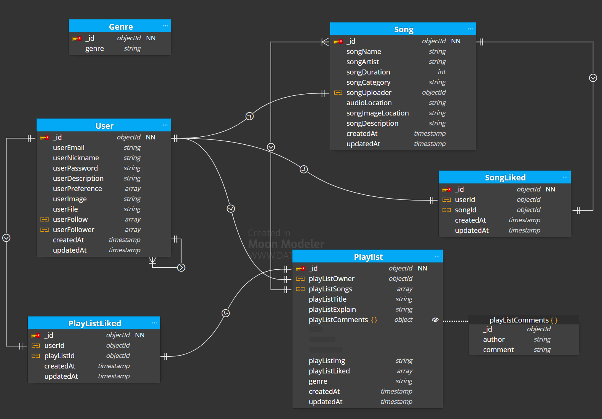
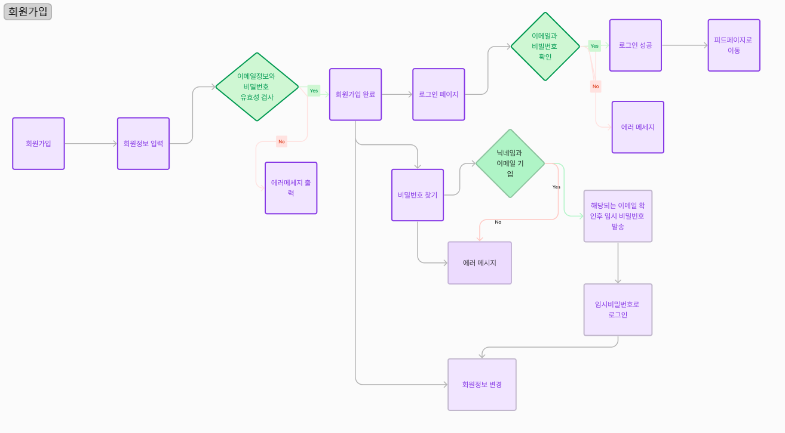
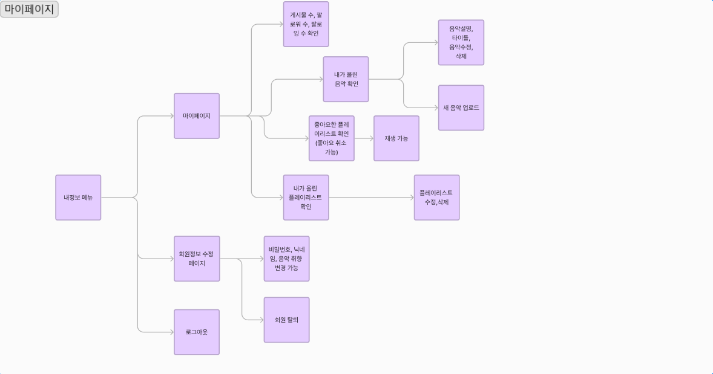
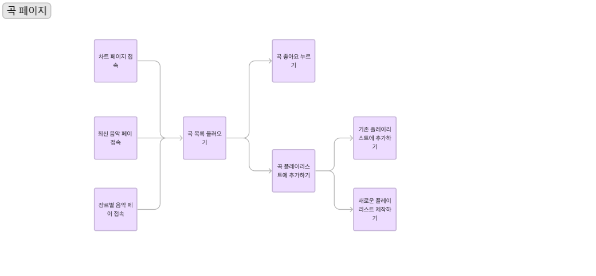
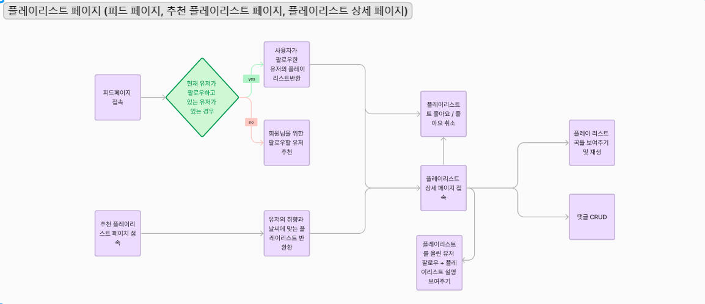

# MINGLE : 플레이리스트 공유 SNS 서비스


### 내 취향 듬뿍 담긴 플레이리스트를 공유하고 싶다면!

다양한 사람들과 취향을 나누는 플레이리스트 공유 플랫폼 MINGLE

## 팀원 소개

| 이름   | 역할             | 링크                                    |
| ------ | ---------------- | --------------------------------------- |
| 윤보영 | 팀장, 프론트엔드 | [깃허브](https://github.com/BoyoungYun) |
| 김남현 | 프론트엔드       |                                         |
| 손영진 | 프론트엔드       |                                         |
| 소유빈 | 백엔드           | [깃허브](https://github.com/kanujoa)    |
| 임종승 | 백엔드           |   [깃허브](https://github.com/limjongseung)                                      |

## 기술 스택

### Frontend


### Backend


## 주요 기능

### [배포 링크]()

|                   |                         |
| ----------------- | ----------------------- |
| **피드페이지**    | **팔로워추천**          |
|                   |                         |
| **회원가입**      | **로그인&비밀번호찾기** |
|                   |                         |
| **플레이리스트**  | **음악재생**            |
|                   |                         |
| **차트**          | **추천플레이리스트**    |
|                   |                         |
| **팔로우&좋아요** | **댓글**                |
|                   |                         |

## 기획

### 1. [프론트 피그마 링크](https://www.figma.com/file/KvAprAzkArxIc1Phjp3ggo/Mingle?type=design&node-id=0-1&mode=design&t=gORcS3Y2YxfDDwc4-0)

### 2. [API 명세서 링크](https://branched-meter-e96.notion.site/1e59def9dc2d4c5b85d9f7a0c9c20dc1?v=d5f47ddeef5842d2b369d65210da554a&pvs=4)

### 3. ERD



### 4. 프로젝트 흐름도

- 회원가입 페이지

  

  <br/>

- 마이페이지

  

<br/>

- 곡 페이지

  

<br/>

- 플레이리스트 페이지

  

<br/>

### 5. 폴더 구조

```bash
├── client
│   ├── components
│   ├── pages
│   ├── hooks
│   ├── types
│   └── utils
├── server
│   ├── routers
│   ├── services
│   ├── db
│   ├── middlewares
│   ├── resources
│   └── utils
└── app.js
```

## 담당 기능

### Frontend

#### 윤보영

- 회원 기능
  - 회원가입
  - 로그인 / 로그아웃
  - 회원 탈퇴
  - 회원정보 get (회원정보 수정 페이지)
  - 전역 axios 설정 (http header에 토큰 담아서 보내도록)
  - 로그인 이메일 저장 기능
- 곡 관련 기능
  - 곡 재생 기능
  - 곡 / 가수명 검색 기능
  - 페이지네이션
  - 장르별 음악 get
  - 유저가 좋아요한 음악 get
  - 곡 상세 페이지 좋아요 기능
- 플레이리스트 관련 기능
  - 특정 플레이리스트 조회 (재생목록 페이지) 기능
  - 피드 페이지 (팔로우한 유저의 플레이리스트 조회)기능
  - 플레이리스트 좋아요 / 좋아요 해제 기능
  - 플레이리스트 검색 기능
- 유저 관련 기능
  - 프로필 사진 변경 기능
  - 유저가 좋아요한 플레이리스트 구현 (마이페이지)
  - 팔로우 실시간 반영되도록 수정

#### 김남현

#### 손영진

---

### Backend

#### 소유빈

- Auth API

  - 이메일 중복확인, 비밀번호 재설정, 유저 정보 수정, 팔로잉할 유저 추천 api 구현

- Playlist API

  - 현재 날씨에 맞는 플레이리스트 추천, 유저가 팔로우한 유저의 플레이리스트 가져오기 api 구현

- Song API

  - 곡 업로드, 수정, 삭제, 정보 가져오기 api 구현
  - 곡 좋아요 누르기, 취소하기 api 구현
  - 차트, 최신순, 장르별로 곡 가져오기 api 구현
  - 곡 이름, 가수명으로 검색 api 구현
  - 현재 로그인한 유저가 좋아요한 곡들, 업로드한 곡들 가져오기 api 구현

- Genre API

  - 장르 가져오기 api 구현

- (프론트) 플레이리스트 관련 기능 구현
  - 플레이리스트 업로드 기능<br/>
    (새 플레이리스트 만들기 / 유저가 이미 만들어놓은 플레이리스트에 곡 추가하기 모두 가능하게)
  - 현재 로그인한 유저가 업로드한 플레이리스트 수정 기능<br/>
    (플레이리스트에서 곡 삭제, 제목 수정, 커버 사진 수정, 내용 수정, 장르 수정 가능하게)
  - 현재 로그인한 유저가 업로드한 플레이리스트 삭제 기능

#### 임종승

- Auth API

  - 회원가입,로그인 연장, 로그인, 회정정보 수정, 유저 설명 수정하기 api구현

- Playlist API

  - 플레이리스트 조회,추가,수정,삭제 기능 api 구현
  - 플레이리스트에 음악 추가, 수정,삭제 api 구현
  - 플레이리스트에 댓글 조회, 추가, 수정, 삭제 api 구현
  - 플레이리스트 타이틀 검색 api 구현
  - 유저가 팔로우한 유저의 플레이리스트 조회 api 구현

- User API

  - 유저가 좋아요한 플레이리스트 api 구현
  - 유저 팔로우, 언팔 api 구현
